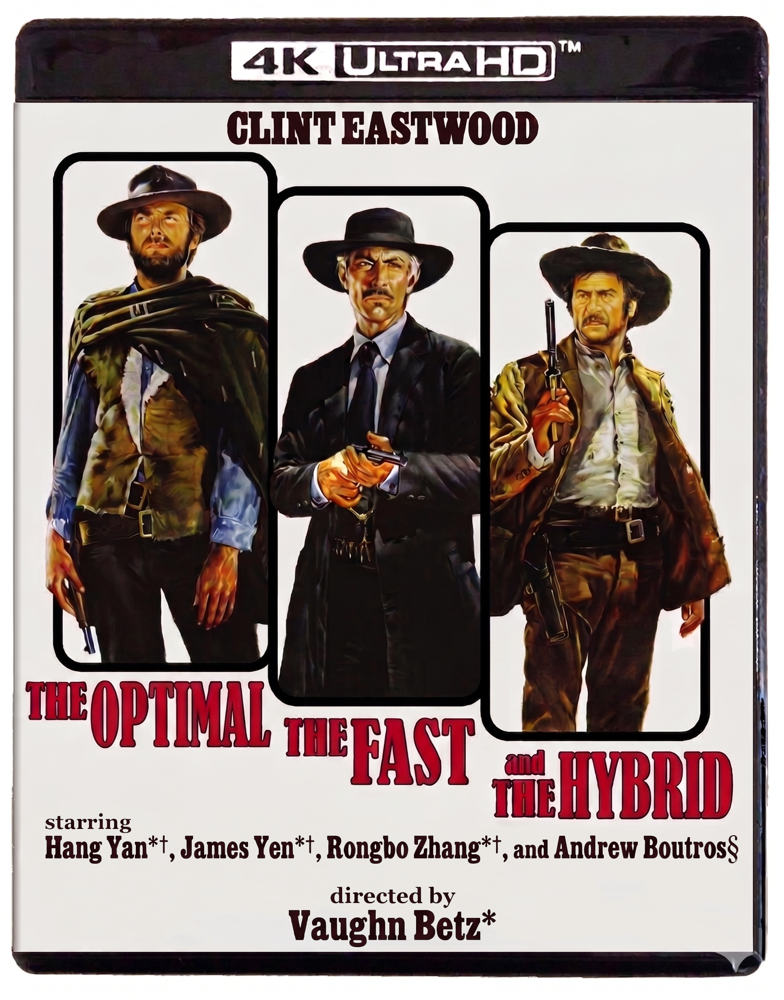
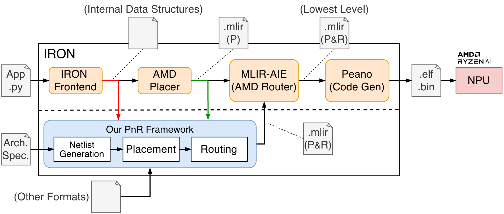

# NPU Flow: Automatic Placement and Routing for AIE Arrays

[**Benchmarks**](benchmarks/) | [**MLIR-AIE**](https://github.com/ueqri/mlir-aie) | [**NPU PnR**](npu-pnr/)

[](LICENSE)

NPU Flow is an open-source placement and routing (PnR) framework for spatial dataflow architectures, with first-class support for AMD's AI Engine (AIE) arrays in Ryzen AI NPUs. It explicitly models the three AIE interconnect types -- shared memory, circuit-switched NoC, and packet-switched NoC -- and jointly reasons about them during placement and routing. NPU Flow offers several key features:

- **Three Placement Algorithms**: A joint placement-and-routing MILP (*The Optimal*), a simulated-annealing placer with a wirelength + legality + congestion cost (*The Fast*), and a local search guided by an MILP oracle (*The Hybrid*).
- **MILP-based Routing Algorithm**: A modified multi-commodity flow formulation that models each interconnect type as separate edges with distinct costs and capacities, enabling mixed-interconnect-type routings.
- **End-to-End MLIR-AIE Integration**: Plugs into AMD's IRON / MLIR-AIE toolchain for deployment on real Ryzen AI silicon, with a 202-benchmark suite of synthetic and real-world dataflow workloads.

<table>
  <tr>
    <td width="35%" align="center">
      
      <br><sub>The Optimal, The Fast, and The Hybrid.</sub>
    </td>
    <td width="65%" align="center">
      
      <br><sub>NPU Flow integration and PnR pipeline.</sub>
    </td>
  </tr>
</table>

## Getting Started

Please check out [`docs/`](docs/) for installation instructions and tutorials. If you encounter any problems, please feel free to open an [issue](https://github.com/ueqri/npu-flow/issues).

## Publication

If you use NPU Flow in your research, please cite our FCCM'26 paper:

> Hang Yan, James Yen, Rongbo Zhang, Andrew Boutros, and Vaughn Betz, "**The Optimal, The Fast, and The Hybrid: Automatic Placement and Routing for AIE Arrays**", *IEEE International Symposium on Field-Programmable Custom Computing Machines (FCCM)*, to appear, 2026.

```bibtex
@inproceedings{npu-flow-fccm26,
  title     = {The Optimal, The Fast, and The Hybrid: Automatic Placement and Routing for {AIE} Arrays},
  author    = {Yan, Hang and Yen, James and Zhang, Rongbo and Boutros, Andrew and Betz, Vaughn},
  booktitle = {IEEE International Symposium on Field-Programmable Custom Computing Machines (FCCM)},
  year      = {2026},
  note      = {To appear}
}
```

Note: First three authors contributed equally.

## Related Projects

- AIE Programming Models & Compilers: [MLIR-AIE](https://github.com/Xilinx/mlir-aie), [IRON](https://github.com/Xilinx/mlir-aie/tree/main/python/iron), [Riallto](https://github.com/AMDResearch/Riallto), [ARIES](https://github.com/arc-research-lab/Aries), [Allo](https://github.com/cornell-zhang/allo)
- AIE Application Frameworks: [CHARM](https://github.com/arc-research-lab/CHARM), [MaxEVA](https://github.com/enyac-group/MaxEVA)
- FPGA CAD: [VTR](https://github.com/verilog-to-routing/vtr-verilog-to-routing)
- Compiler Infrastructure: [MLIR](https://mlir.llvm.org/)
